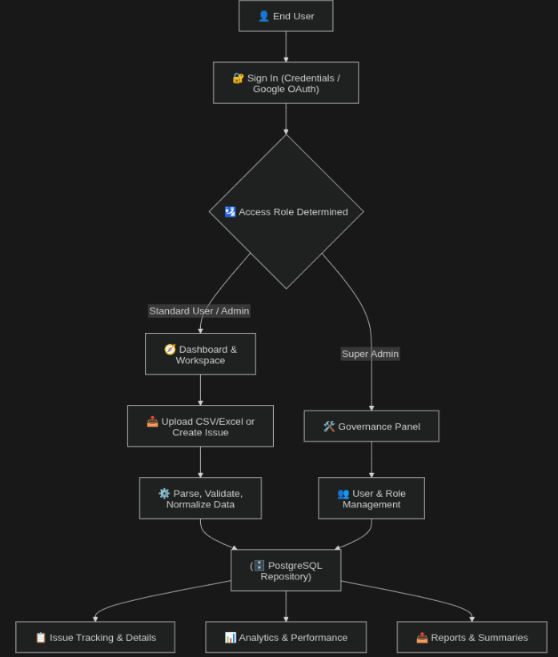
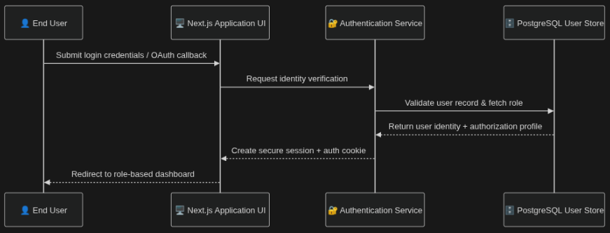
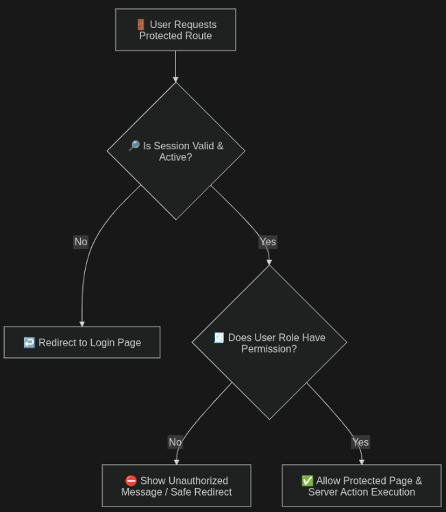
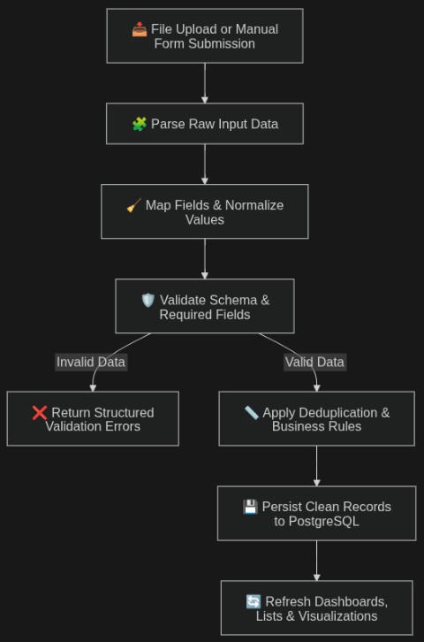
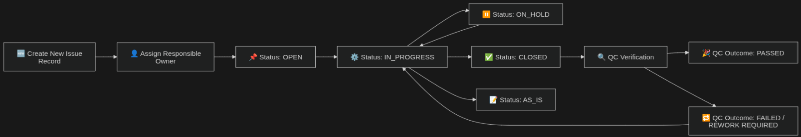
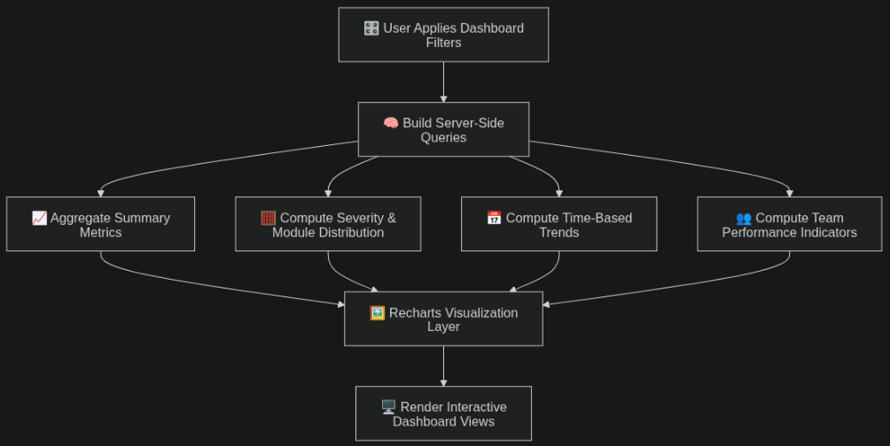

# Sheet WebApp — Project Documentation

## 1. Project Overview

**Project Name:** Sheet WebApp  
**Description:** Sheet WebApp is a centralized QA issue management platform built to replace spreadsheet-heavy defect tracking with a structured, scalable, and analytics-first workflow. It standardizes how teams ingest issue data, validate quality records, track ownership, and generate decision-ready reports from a single source of truth.  
**Primary Goal:** Eliminate dependency on Excel-based processes and establish a reliable system for real-time issue tracking, collaboration, and performance analytics.

### Why this project exists

In spreadsheet-driven workflows, teams often face inconsistent formats, duplicated records, delayed reporting, and fragmented accountability. Sheet WebApp addresses these gaps by introducing:

- Controlled ingestion with validation.
- Unified issue lifecycle management.
- Role-based ownership and secure access.
- Visual analytics that update from current system data.

---

## 2. Objectives

- Replace manual Excel workflows with a unified platform.
- Provide near real-time visibility into issue lifecycle and ownership.
- Enable analytics-driven QA and management decisions.
- Reduce redundancy, formatting drift, and manual entry errors.
- Centralize data access with role-based governance.

---

## 3. System Architecture

### 3.1 Technology Stack

#### Frontend

- Next.js (App Router)
- React
- TailwindCSS
- Recharts

#### Backend

- Next.js API Routes / Server Actions
- Prisma ORM
- Zod-based validation layer

#### Database

- PostgreSQL (current production database)
- MongoDB (planned migration/expansion path)

#### Supporting Tools

- XLSX (Excel parsing)
- PapaParse (CSV parsing)
- Nodemailer (email services)

### 3.2 Architecture principles

- **Server-controlled writes:** Client never writes directly to the database.
- **Validation-first ingestion:** Every imported or manually entered record is checked.
- **Traceability:** Ownership fields such as source file and uploaded user are preserved.
- **Composable analytics:** Dashboards are powered by filtered, query-driven aggregates.

### 3.3 Technical deep dive

#### Request lifecycle (App Router + server execution)

1. UI events (filter changes, form submit, upload) are handled in React components.
2. Data operations are delegated to server-side handlers (API routes / server actions).
3. Input payloads are validated via schema checks before any persistence.
4. Business rules are applied (normalization, dedup checks, role checks).
5. Database reads/writes execute in PostgreSQL, and response data is returned to the UI.

#### Data model and consistency strategy

- Primary entities include users, issues, source files, sessions, and roles.
- Referential links (issue owner, uploaded by, source file) provide traceability.
- Enum-based fields (status, severity, QC states) reduce inconsistent free-text values.
- Script-driven schema evolution is used to roll forward new fields safely.

#### Query and analytics pipeline

- Dashboard metrics are generated through grouped and filtered database queries.
- Filters are translated into server-side query predicates.
- Visualization payloads are shaped for chart libraries with minimal client transforms.
- Export endpoints reuse the same filter logic to avoid report/data mismatch.

#### Security and access control model

- Authentication creates session-bound access with protected route checks.
- Authorization is role-aware (User/Admin/Super Admin) for privileged operations.
- Critical operations (user management, credential control) are restricted to Super Admin paths.
- Validation and server-side writes reduce trust in client input and prevent unsafe mutations.

#### Performance and scalability considerations

- Server-side filtering avoids heavy client-side data scans.
- Aggregated analytics reduce repeated computation in UI components.
- Pagination protects list views from excessive payload size.
- Planned realtime sync will decouple write path from client refresh path via event delivery.

---

## 4. Overall Application Flow

The overall flow starts with authenticated access, then branches into ingestion, issue operations, and analytics consumption. All branches converge at the same centralized issue repository.

---

## 5. Core Features

### 5.1 Excel Import System

The import module allows teams to upload Excel/CSV files and convert them into normalized issue records.

- Upload `.xlsx` or `.csv` files.
- Parse rows and map column aliases.
- Validate mandatory fields and enum values.
- Reject invalid rows with structured error feedback.
- Persist only valid records.

### 5.2 Issue Tracking System

The issue system acts as the operational backbone of the platform.

- Centralized issue repository for all teams.
- Editable issue lifecycle (status, severity, assignee, QC state).
- Detail and list views for triage and follow-up.
- Core issue fields:

  - Test Case ID
  - Summary
  - Severity
  - Assigned To
  - Source File
  - Uploaded By

### 5.3 Analytics Dashboard

The analytics area provides visibility from high-level KPIs to trend-level detail.

- Severity distribution and backlog composition.
- Workload split by assignee/team.
- Trend charts over time (volume and closure behavior).
- Filter-aware visualizations for faster decision support.

### 5.4 User and Access Management

- Role-based access (Admin / Super Admin).
- Session-based authentication and route protection.
- Google OAuth support.
- Super Admin controls for privileged user lifecycle actions.

---

## 6. Authentication and Authorization Flow

### Role enforcement flow

---

## 7. Data Ingestion and Processing Flow

This flow applies to both bulk import and structured manual entry.

---

## 8. Issue Management Workflow

### Operational steps

1. Issue enters system from upload or manual sheet.
2. Required fields are validated and stored.
3. Owner is assigned for actionability.
4. Status transitions are tracked for lifecycle reporting.
5. QC state reflects validation outcomes.
6. Dashboards update from latest persisted state.

---

## 9. Analytics Generation Flow

---

## 10. Planned Real-Time Sync Flow

---

## 11. Database Design (High-Level)

### Entities

- Users
- Issues
- SourceFiles
- Roles
- Auth Tables

### Relationships

- One User → Many Issues
- One File → Many Issues
- One Issue → One Assigned User
- One User → Many Sessions

### Data design intent

- Maintain auditability for upload origin and ownership.
- Support filtered analytics with indexed dimensions.
- Keep extensibility for planned dual-store evolution.

### 11.1 Suggested indexing strategy (technical)

To keep reporting and operational screens responsive at scale, indexing should prioritize frequent filter dimensions and timeline queries.

- Composite index candidates: (`status`, `severity`), (`assignedTo`, `status`), (`issueTestDate`, `status`).
- Time-series analytics: index reported/fixed dates used in trend charts.
- Ownership queries: index assignee/uploader fields for team and audit pages.
- Source lineage: index source file references for import traceability.

### 11.2 Transaction and integrity guidance (technical)

- Use transactional writes for multi-row import batches when strict atomicity is required.
- Keep duplicate detection logic deterministic (stable keys + normalized text fields).
- Enforce enum/value constraints at validation and persistence boundaries.
- Store ingestion metadata (`uploadedBy`, source file, timestamps) for audit and rollback analysis.

### 11.3 Migration direction toward MongoDB (technical)

- Start with a coexistence model, not a hard cutover.
- Keep PostgreSQL as source of truth during transition phases.
- Migrate analytics/read models incrementally where document shape offers clear benefit.
- Validate parity between SQL and Mongo result sets before switching critical dashboards.

---

## 12. Current Implementation Status

| Feature | Status |
| --- | --- |
| Excel Import | ✅ Completed |
| Issue Tracking | ✅ Completed |
| Analytics Dashboard | ✅ Completed |
| Authentication | ✅ Completed |
| Role Management | ✅ Completed |

---

## 13. Future Enhancements

### High Priority

- Enforce signup verification before activation.
- Tighten Super Admin credential and access controls.
- Deliver real-time updates through event-driven sync.

### Medium Priority

- Incremental MongoDB migration strategy.
- UI/UX improvements for faster triage and issue resolution.

---

## 14. Scripts and Utilities

| Script | Purpose |
| --- | --- |
| `init-db` | Initialize database schema and baseline setup |
| `add-testCaseId` | Add or patch Test Case ID support |
| `migrate-critical-to-major` | Normalize severity values |
| `add-auth-tables` | Create authentication-related tables |
| `create-user` | Create standard user accounts |
| `create-super-admin` | Create privileged super admin account |

---

## 15. Challenges and Risks

- **Data inconsistency risk:** Varying upload templates and column naming patterns.
- **Real-time complexity risk:** Ordering, duplication, and reconciliation during live updates.
- **Migration risk:** Schema-model mismatch risk while introducing MongoDB pathways.
- **Adoption risk:** Transition friction for teams accustomed to spreadsheet operations.

---

## 16. Roadmap

### Phase 1 (Completed)

- Ingestion pipeline, issue repository, analytics, authentication, and role controls.

### Phase 2 (In Progress)

- Security hardening and policy enforcement for account lifecycle operations.

### Phase 3 (Planned)

- Realtime collaboration and synchronization.
- Hybrid data strategy evolution (PostgreSQL + MongoDB).
- Usability and performance enhancements for scale.

---

## 17. Conclusion

Sheet WebApp provides a professional, scalable replacement for Excel-centric issue tracking. By combining structured ingestion, centralized lifecycle ownership, and analytics-ready reporting, it improves QA governance, reduces avoidable manual errors, and positions the organization for real-time and large-scale operational maturity.

---

## 18. Layman Section (Manager View)

### What this system does in simple terms

Sheet WebApp is a single online workspace where your team can upload issue data, track who is working on what, and instantly view progress through dashboards. Instead of handling multiple Excel files, everyone works from one centralized system.

### Why this matters to management

- You get one source of truth for QA issues.
- You can see team workload and bottlenecks quickly.
- Reports become faster and more consistent.
- Errors from manual spreadsheet work are significantly reduced.

### What outcomes to expect

- Better visibility into critical issues and pending work.
- Faster follow-up because ownership is clear.
- Improved confidence in status reporting during reviews.
- Stronger operational control as the system scales.

### One-line summary

This platform turns scattered spreadsheet tracking into a reliable, measurable, and manager-friendly QA operations system.
